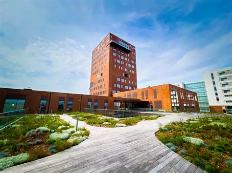

<!-- TODO: unhide when registration opens -->

:::: content-hidden
::: {.callout-important icon="false"}
## ✍ Registration is now open!

Please follow this link to register \[insert link\] for the symposium and meeting. During registration, you can indicate whether you would like to give a short, 10 minute presentation on your work related to diabetes registers, demography, or related methods.

If it turns out that you will not be able to attend after you have registered, please do not forget to cancel your registration.
:::
::::

## 1 year of DP-Next

On the 1st of September we will reach the 1-year mark of the DP-Next project. We have achieved several early milestones and as the project is now in full swing we think it is a good opportunity to get together, share our experiences so far and make plans for the following years.

The objective for the day is to share early results and experiences, to introduce ourselves to each other, sharing the various PhD and post-doc projects that form part of DP-Next. It will also be an opportunity to meet the members of the DP-Next Scientific Advisory Board and discuss our protocols and methods with them.

During the day, we will also have the opportunity to present DP-Next to the wider researcher community at Steno Diabetes Center during one of the Steno Thursdays meetings.

## Date and time

::: callout-note
🗓 24 September 2026

🕰️ 10:00 - 17:00
:::

## Location

::: {.callout-note icon="false"}
## 🏛️ Steno Diabtes Center Aarhus

Verdensrummet AUD. A20

Palle Juul Jensens Boulevard 99

8200 Aarhus, Denmark
{#fig-auditoriums width="657"}
:::

::: {.callout-note icon="false"}
## ️🖥️ Join us Online

The seminar and meeting will also be streamed online for those who cannot join us in Aarhus. Please register through the link above and write 'online' in the Dietary Requirements field.

Join us via Zoom \[add zoom link\]

Meeting ID: xxxx Passcode: xxxxx
:::

## Programme

+-----------+-----------+--------------------------------------------+-----------------+
| Start     | End       | Title                                      | Speaker         |
+===========+===========+============================================+=================+
| *10:00*   | *10:30*   | *Coffee*                                   | *-*             |
+-----------+-----------+--------------------------------------------+-----------------+
| 10:30     | 10:45     | Welcome and overview of DP-Next so far     | Daniel Witte    |
+-----------+-----------+--------------------------------------------+-----------------+
| 10:45     | 11:00     | WP1: Progress so far and plans             | Luke Johnston   |
+-----------+-----------+--------------------------------------------+-----------------+
| 11:00     | 11:15     | WP2: Progress so far and plans             | Stine Byberg    |
+-----------+-----------+--------------------------------------------+-----------------+
| *11:15*   | *11:30*   | WP3: Progress so far and plans             | Claus Bogh Juhl |
+-----------+-----------+--------------------------------------------+-----------------+
| 11:30     | 11:45     | WP4: Progress so far and plans             | Jane Østergaard |
+-----------+-----------+--------------------------------------------+-----------------+
| 11:45     | 12:00     | Questions and Discussion                   |                 |
+-----------+-----------+--------------------------------------------+-----------------+
| *12:00*   | *12:30*   | *Lunch*                                    | *-*             |
+-----------+-----------+--------------------------------------------+-----------------+
| 12:30     | 14:00     | Short Presentations                        |                 |
+-----------+-----------+--------------------------------------------+-----------------+
| 12:30     | 12:40     | Short Presentation 1                       |                 |
+-----------+-----------+--------------------------------------------+-----------------+
| 12:40     | 12:50     | Short Presentation 2                       |                 |
+-----------+-----------+--------------------------------------------+-----------------+
| 12:50     | 13:00     | Short Presentation 3                       |                 |
+-----------+-----------+--------------------------------------------+-----------------+
| 13:00     | 13:10     | Short Presentation 4                       |                 |
+-----------+-----------+--------------------------------------------+-----------------+
| 13:10     | 13:20     | Short Presentation 5                       |                 |
+-----------+-----------+--------------------------------------------+-----------------+
| 13:20     | 13:30     | Short Presentation 6                       |                 |
+-----------+-----------+--------------------------------------------+-----------------+
| 13:30     | 13:40     | Short Presentation 7                       |                 |
+-----------+-----------+--------------------------------------------+-----------------+
| 13:40     | 13:50     | Short Presentation 8                       |                 |
+-----------+-----------+--------------------------------------------+-----------------+
| 13:50     | 14:00     | Short Break and setup for Steno Thursdays  |                 |
+-----------+-----------+--------------------------------------------+-----------------+
| *14:00*   | *15:00*   | *DP-Next sessions at Steno Thursdays*      | *-*             |
+-----------+-----------+--------------------------------------------+-----------------+
| 15:00     | 15:30     | Coffee and cake                            |                 |
+-----------+-----------+--------------------------------------------+-----------------+
| 15:30     | 16:30     | Group work in parallel sessions:           |                 |
|           |           |                                            |                 |
|           |           | -   Working together effectively           |                 |
|           |           |                                            |                 |
|           |           | -   Using AI in research and data analysis |                 |
|           |           |                                            |                 |
|           |           | -   Other ideas..                          |                 |
+-----------+-----------+--------------------------------------------+-----------------+
| *16:30*   | *17:00*   | Plenary presentations of group work        | *-*             |
+-----------+-----------+--------------------------------------------+-----------------+
| 17:00     | 17:00     | Final words and end of seminar             |                 |
+-----------+-----------+--------------------------------------------+-----------------+

: Draft Program {tbl-colwidths="\[10,10,50,30\]" .striped}

## Short Presentations

| Name | Work Package | Affiliation |
|------|--------------|-------------|
|      |              |             |

: Short presentation presenter list {tbl-colwidths="\[30,50\]" .striped}

## Speakers
